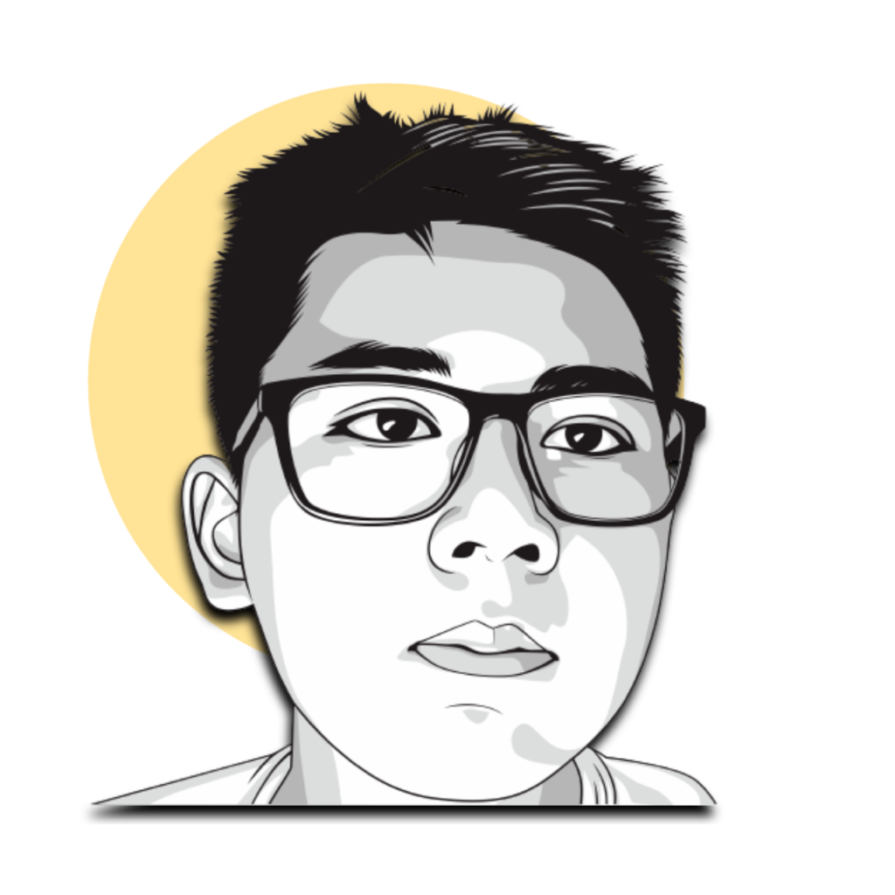

  

Hello! 👋 I'm Hendra Manudinata, a middle school student who loves code so much! I know some programming languages e.g. Python, Bash, C, and JavaScript, and I'm learning more of 'em.

Most of the time I'm working on Android development, such as custom Android Kernel, custom recoveries, and (hopefully) custom ROMs. All of my projects are available on my [GitHub](https://github.com/hendramanudinata03). Oh, if you like my work, please say "Thanks", that will help a lot!

I'm an open-source lover. I'm trying to use FOSS software as much as I can, as well as creating and contributing to open-source software/community. Just like Linus Torvalds says: _"Software is like s\*x: It's better when it's free."_ So be it! **_But I do like proprietaries also. Who doesn't? 😝_**

I'm available on [Telegram](https://t.me/hendramanudinata03) and my [Email](mailto:hendra@manudinata.me) can be publicly contacted if you want to reach out. Say "Hi" to me, and I'd love to answer it!
